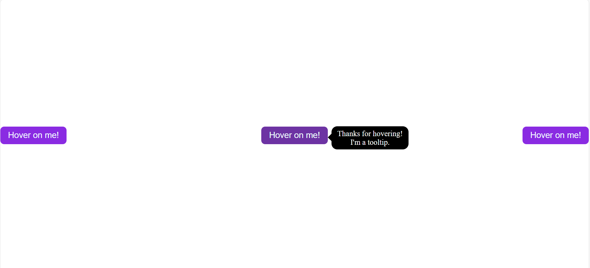
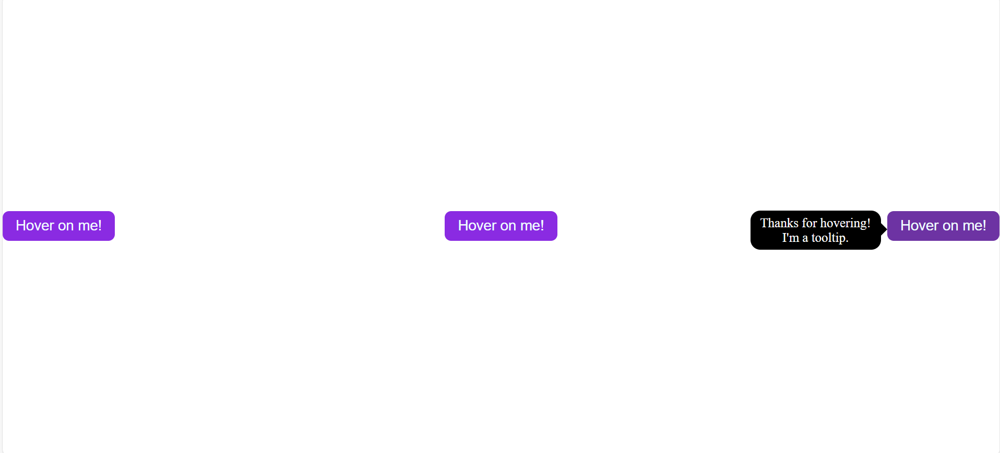

# Tooltip in React

This is a tooltip created in React from scratch. The tooltip is shown whenever we hover over the element like button. The direction of the tooltip also changes depending on the position of the element on which we are hovering over.


## Deployment

To deploy this project run

```bash
  npm run deploy
```


## Screenshots





<div style="border:5px solid red">
  
</div>

<hr>


## Usage/Examples

```javascript
import Component from 'my-project'

function App() {
  return <Component />
}
```


## Support

For support, email fake@fake.com or join our Slack channel.


## Installation

Install my-project with npm

```bash
  npm install my-project
  cd my-project
```
    
## Demo

Insert gif or link to demo

## Color Reference

| Color             | Hex                                                                |
| ----------------- | ------------------------------------------------------------------ |
| Example Color |  #0a192f |
| Example Color |  #f8f8f8 |
| Example Color |  #00b48a |
| Example Color |  #00d1a0 |


## Features

- Light/dark mode toggle
- Live previews
- Fullscreen mode
- Cross platform

